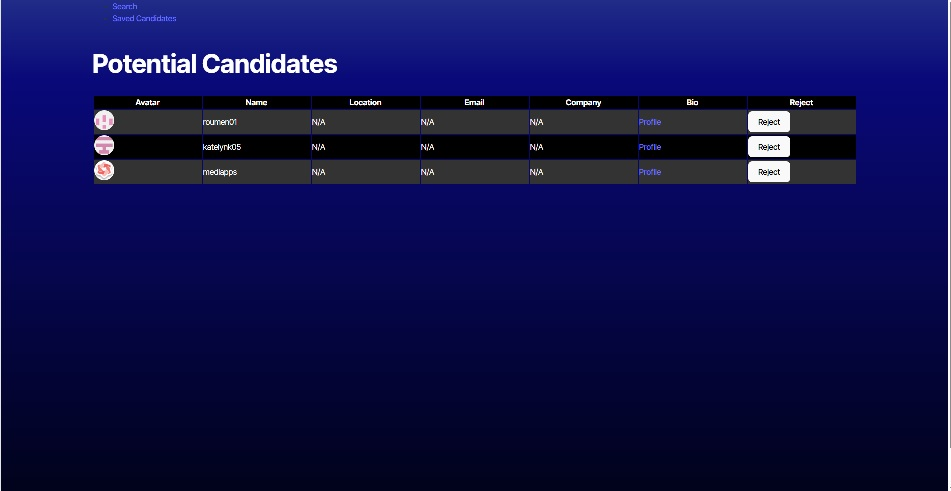

# operationSearchCandidates
  
  
  ## Description
  This website allows you to search for and save potential job candidates. Here is the link to the website: https://challenge-13-jobcandidates.onrender.com/
  
  ## Table of Contents
  - [Installation](#installation)
  - [Usage](#usage)
  - [Credits](#credits)
  - [License](#license)
  - [Features](#features)
  - [Tests](#tests)
  - [Questions](#questions)

## Screenshots

  
  ## Installation
  No installation necessary for utilizing the live site. For local use, clone git repository https://github.com/jsavino26/challenge-13-jobcandidates.git, download nodes package and create personal github token. 
  
  ## Usage
  You can use this product to search for potential job candidates and save them in a list to your local storage 
  
  ## Credits
  Jen Savino
  
  ## License
  MIT
  
  ## Features
  This product features typescript, javascript, css, and html
  
  ## Tests
  You can test the index.js file when you open the integrated terminal and type the command: npm run dev
  
  ## Questions
  If you have any questions, please feel free to contact me:
  
  - GitHub: [jsavino26](https://github.com/jsavino26)
  - Email: jensavino26@gmail.com
